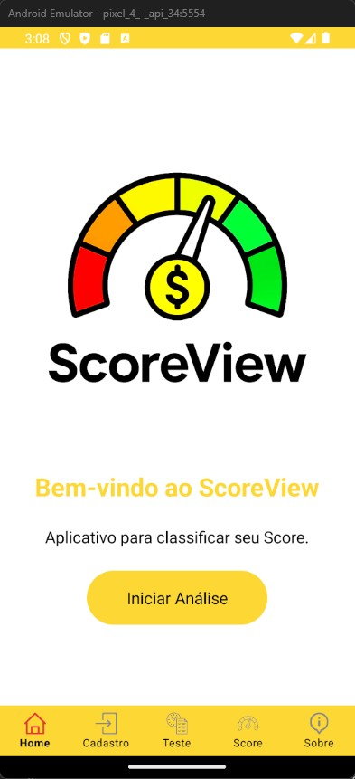
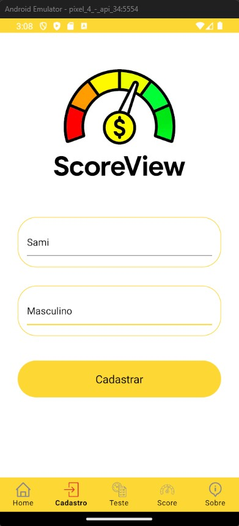
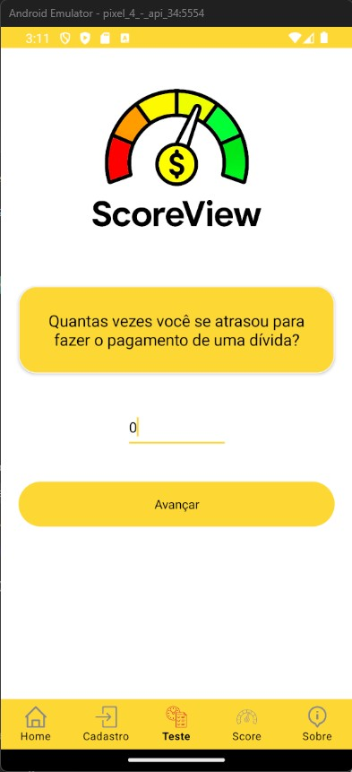
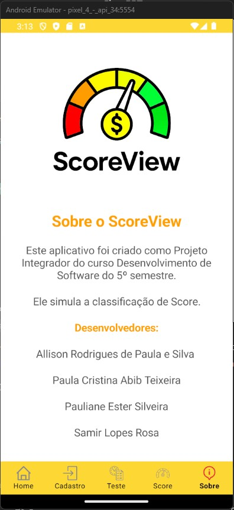

<p align="center">
  
</p>

<h1 align="center">PROJETO PI 5º DSM - FATEC FRANCA - 2025-1</h1>

<p align="center">
Aplicativo mobile que realiza uma análise de crédito com base nas respostas de um questionário.  
Utiliza modelos de Machine Learning treinados com dados históricos para classificar o score do usuário em três níveis: <strong>Baixo</strong>, <strong>Médio</strong> ou <strong>Alto</strong>.
</p>

---

## 👨‍💻 Participantes

- [Allison Rodrigues de Paula e Silva](https://github.com/allisonrps)  
- [Paula Cristina Abib Teixeira](https://github.com/jed1rey)  
- [Pauliane Ester Silveira](https://github.com/PaulianeSilveira)  
- [Samir Lopes Rosa](https://github.com/SamLope)

---

## 🚀 Funcionalidades

- ✔ Cadastro de Usuário: Nome e sexo  
- ✔ Questionário Dinâmico: 10 perguntas sobre finanças pessoais  
- ✔ Integração com API: Envio dos dados para cálculo do score  
- ✔ Resultado Visual: Exibição do score ao final do teste

---

## 🎥 Demonstrações

- 📽️ [Video Pitch no YouTube](https://youtu.be/ZhKnlGcdRXU)  
- 🎬 [Video Demo do Aplicativo](Imagens/Video%20Demo/ScoreView.mp4)

---

## 🖼 Telas do Aplicativo

| INICIAL | CADASTRO | QUESTIONÁRIO |
|--------|----------|--------------|
|  |  |  |

| RESULTADO ALTO | RESULTADO BAIXO | SOBRE |
|----------------|-----------------|--------|
|  |  |  |

---

## ☁️ Infraestrutura na Nuvem

### Máquina Virtual na Azure

- **Provedor**: Microsoft Azure (Azure for Students)  
- **Sistema Operacional**: Ubuntu 24.04 LTS (x64)  
- **Tamanho da VM**: Standard D2s v3 (2 vCPUs, 8 GiB de RAM)  
- **Localização**: West US 2 – Zona 2  
- **Endereço IP Público**: `20.64.236.211`  
- **Nome DNS**: [`scoreviewbackend.westus2.cloudapp.azure.com`](http://scoreviewbackend.westus2.cloudapp.azure.com)

> 🔐 **Importante**: Garanta que as portas `3306`, `4000` e `5000` estejam liberadas na VM para acesso ao MySQL, API Node e API Python.

---

## ⚙️ Instruções para Executar o Projeto

### 1. Clone o Repositório

```bash
git clone https://github.com/FatecFranca/DSM-P5-G01-2025-1.git
cd DSM-P5-G01-2025-1
```

---

### 2. Backend (Node.js)

```bash
cd Backend
npm install
```

Crie um arquivo `.env` com as credenciais do seu banco de dados:

```env
DB_HOST=localhost
DB_PORT=3306
DB_USER=seu_usuario
DB_PASSWORD=sua_senha
DB_NAME=score_view
```

**Crie o banco e as tabelas MySQL:**

1. Acesse seu MySQL:

```sql
CREATE DATABASE score_view;
```

2. Execute os comandos SQL contidos no arquivo:

```
Backend/model_db/scripts_sql.txt
```

**Execute o servidor Node.js:**

```bash
npm run dev
```

A API será iniciada na porta `4000`.

---

**Execute o API Python com Machine Learning:**

```bash
cd ML-API
pip install -r requeriments.txt
python app.py
```

A API será iniciada na porta `5000`.


---

## 📊 Backend (API + Banco)

- Node.js + Express  
- MySQL  
- Swagger para documentação da API  
- Modelo relacional:


- [Documentação Swagger](https://app.swaggerhub.com/apis/ALLISONRPS/Score_View/1.0.0)

---

## 📱 Frontend Mobile

> Requer Android SDK e .NET MAUI instalados
Abra a pasta `Mobile/` em um editor como o Visual Studio e execute o projeto em um emulador ou dispositivo Android.
- Desenvolvido com [.NET MAUI](https://learn.microsoft.com/pt-br/dotnet/maui/what-is-maui)  
- Estrutura:

```plaintext
Mobile/
├── Models/            # Entidades (Usuario, Pergunta, Resposta, etc.)
├── ViewModels/        # Lógica das telas (TesteViewModel, etc.)
├── Views/             # Telas XAML (CadastroPage, TestePage, etc.)
├── Services/          # ApiService, LocalStorageService
├── Resources/         # Estilos, imagens, fontes
└── MauiProgram.cs     # Configuração principal do app
```

---

## 🧠 Machine Learning

- 🔗 [Documentação da Pasta Machine Learning](MachineLearning/README.md)  
- 📊 [Dataset - Kaggle](https://www.kaggle.com/datasets/parisrohan/credit-score-classification)

### Bibliotecas

- Python, Pandas, Scikit-learn, Jupyter


## ✅ Conclusão

Este projeto integra Backend (Node.js + MySQL), Frontend Mobile (.NET MAUI) e uma API Python com modelo de Machine Learning. Foi implantado na Azure com foco em análise de crédito e aplicação prática de IA.

---
